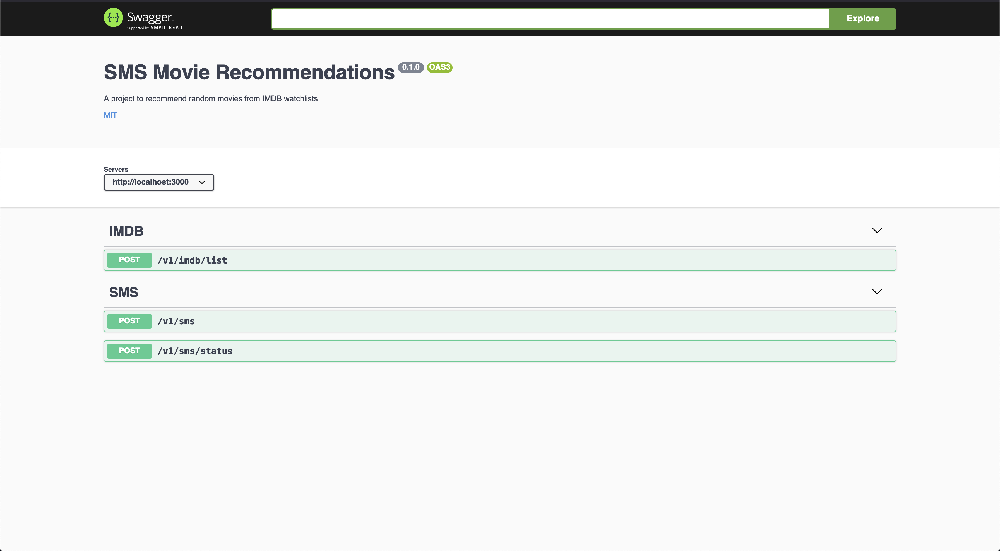

# SMS Movie Recommendations

## Getting Started

### Installation

1. install the dependencies using `npm install` or `npm i`

2. Copy the file `.env.example` to `.env` at the root of the project and edit with appropriate values.

3. Start the app using `npm run dev`

4. After that, go to: `http://localhost:3001/docs`

### Available scripts

- `build` - Transpile TypeScript to ES6,
- `lint` - Lint your TS code,
- `dev` - To run the app without transpile to ES6,
- `clean` - Remove dist, node_modules, coverage folders,
- `start` - Run the transpiled app
- `prod` - Build & run the transpiled app
